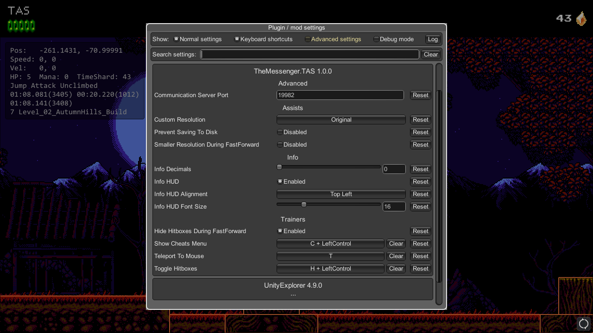
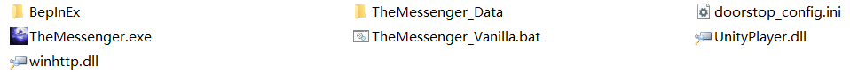
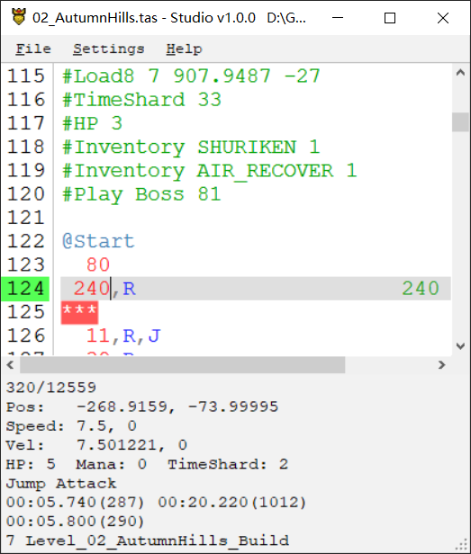

# TheMessenger.TAS

Simple TAS Tools for the game [The Messenger](https://themessengergame.com/).

## How to use

1. [Download](https://github.com/DemoJameson/TheMessenger.TAS/releases) the zip then unzip all files into the game folder.
2. Run `TheMessenger.exe` will start the game with tas plugin now.
3. Press `F1` show settings.
4. Run `TAS.Stuido.exe` write tas. If the game does not respond when frame advancing,
you can still take control of the tas play in `TAS.Studio.exe`.

### Known Issues
1. The game will randomly pop up a crash dialog, but as long as you ignore it and don't click the button above, the game will still run normally, but the game may be forced to close after some time.
2. `Load`/`FastLoad` command cannot accurately set the player's y coordinate.

## Input File
The input file is a text file with tas as an extension.

Format for the input file is `Frames,Actions`, e.g. `123,R,U` (For 123 frames, hold Right and Up)

## Actions Available
- L = Left
- R = Right
- U = Up or Jump
- D = Down
- J = Jump and Confirm
- G = Rope Dart and Back
- A = Attack
- S = Shuriken
- T = Lightfoot Tabi
- M = Map
- I = Inventory
- P = Pause

## Special Input

### Breakpoints
- You can create a breakpoint in the input file by typing `***` by itself on a single line
- The program when played back from the start will fast forward until it reaches that line and then go into frame stepping mode
- You can specify the speed with `***X`, where `X` is the speedup factor. e.g. `***10` will go at 10x speed, `***0.5` will go at half speed.

### Comment
- Prefixing a line with `#` will comment out the line.

### Commands
Various commands exist to facilitate TAS playback. Command delimiters can be either spaces or commas.

#### Repeat and EndRepeat
- Repeat the inputs between `Repeat` and `EndRepeat` several times, nesting is not supported.
- `Repeat, Count`
- `EndRepeat`

#### Read
- `Read, File Name, Starting Line/Lable, (Optional Ending Line/Label)`
- Will read inputs from the specified file.
- If a custom path to read files from has been specified, it tries to find the file there. Otherwise, it will look for the file in the tas directory.
- e.g. `Read, 1A - Forsaken City.tas, 6` will read all inputs after line 6 from the `1A - Forsaken City.tas` file
- This will also work if you shorten the file name, i.e. `Read, 1A, 6` will do the same
- It's recommended to use labels instead of line numbers, so `Read, 1A, lvl_1` would be the preferred format for this example.

#### Play
- `Play, Starting Line/Label, (Optional Frames to Wait)`
- A simplified `Read` command which skips to the starting line in the current file.
- Useful for splitting a large level into smaller chunks.

#### Label
- A line beginning with `@` can be used as the starting point or ending point of a `Read/Play` command.

#### FrameRate
- `FrameRate, integers greater than 0`
- Set the game's FPS, default 50FPS

#### Seed
- `Seed, any string`
- Different seeds will produce different RNGs, you can use this command any time to change the subsequent RNGs, which only work on the current room

#### LoadSave
- `LoadSave, save file path, save slot index`
- Usually used before the `Load` command to restore the save file state

#### Load and FastLoad
- `Load8, SceneName/ScendBuildIndex`
- `Load16, SceneName/ScendBuildIndex`
- `Load8, SceneName/ScendBuildIndex, PositionX, PositionY`
- `Load16, SceneName/ScendBuildIndex, PositionX, PositionY`
- Load the specified scene and set player to the specified position.
- The `Load` command will completely reload the level, while `FastLoad` will not. If you have problems with `FastLoad`, try switching to the `Load` command.

#### ExternalSpeed
- `ExternalSpeed, SpeedType, SpeedX`
- Set player external speed, currently supported speed types are `EnemyReceiveHit` and `GraplouKnockback`.

#### AlwaysDropItem
- `AlwaysDropItem, Default/TimeShard/Mana/HP`
- Make enemies always drop specific item if possible.

#### AlwaysRespawnBreakable
- `AlwaysRespawnBreakable, True/False`
- Make breakable objects always respawn, such as breakable blocks.

#### HasClimbed
- `HasClimbed, True/False`
- Set `HasClimbed` to true, so that player do not need to grab the wall before they can kick the wall.

#### NextKnockBackDirection
- `NextKnockBackDirection, Right/Left`
- Since spike damage boost depends on the update order of the spikes, it is rather random, you need to use this command to force the direction of the next knock back.

#### TimeShard/HP/Mana
- `TimeShard/HP/Mana, quantity`

#### RecordCount
- e.g. `RecordCount: 1`
- Every time you run tas after modifying the current input file, the record count auto increases by one.

#### Time
- e.g. `Time: 00:27.900(1396)`
- The room time is automatically filled in when the command is run

#### LevelTime
- e.g. `LevelTime: 04:10.177(12509)`
- The level time is automatically filled in when the command is run

## Playback of Input File
### Controller
While in game or TAS.Studio
- Playback/Stop: Right Stick
- Restart: Left Stick
- When Playing Back
    - Faster/Slower Playback: Right Stick X+/X-
    - Frame Step: DPad Up
    - While Frame Stepping:
        - One more frame: DPad Up
        - Continue at normal speed: DPad Down
        - Frame step continuously: Right Stick X+

### Keyboard
While in game or TAS.Studio
- Playback/Stop: RightControl
- Restart: =
- Faster/Slower Playback: RightShift / Alt+LeftShift
- Frame Step: [
- While Frame Stepping:
    - One more frame: [
    - Continue at normal speed: ]
    - Frame step continuously: RightShift

## TAS.Studio
Can be used instead of notepad or similar for easier editing of the TAS file. It is bundled with the TAS tools

### Controls
- Ctrl + Z: Undo
- Ctrl + Shift + Z: Redo
- Ctrl + O: Open File
- Alt + Left: Open Previous File
- Ctrl + Shift + S: Save As
- Ctrl + F: Find Text
- Ctrl + G: Go to Line/Label
- Ctrl + Shift + D: Refresh Connection Between Studio and Game
- Ctrl + Shift + C: Copy Player Data to Clipboard
- Ctrl + K: Block Comment/Uncomment (line by line processing)
- Ctrl + Shift + K: Block Comment/Uncomment
- Ctrl + P: Remove All Uncommented Breakpoints
- Ctrl + Shift + P: Remove All Breakpoints
- Ctrl + .: Insert/Remove Breakpoint
- Ctrl + R: Insert room name
- Ctrl + Shift + R: Insert Load Command at Current Level
- Ctrl + T: Insert Current in-game Time
- Ctrl + L: Combine Consecutive Same Inputs
- Ctrl + Shift + L: Force Combine Inputs Frames
- Ctrl + Down/Up: Go to Comment or Breakpoint
- Ctrl + Left Click on Read/Play Command: Open the read file / Go to the Play Line
- Right Click on Input Area: Show Input Context Menu
- Right Click on Info Area: Show Info Context Menu
- Shift + Mouse Wheel: Tweak Frames Between Selected Input and Mouse Pointed Input
- Ctrl + Shift + Up/Down: Tweak Frames Between Selected Inputs
- Ctrl + Alt + C: Copy File Path

## Credits
* [CelesteTAS-EverestInterop](https://github.com/EverestAPI/CelesteTAS-EverestInterop)
* [TrainerReborn](https://github.com/Brokemia/TrainerReborn)